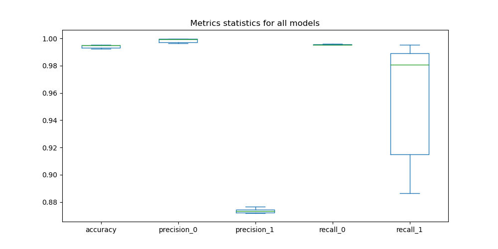
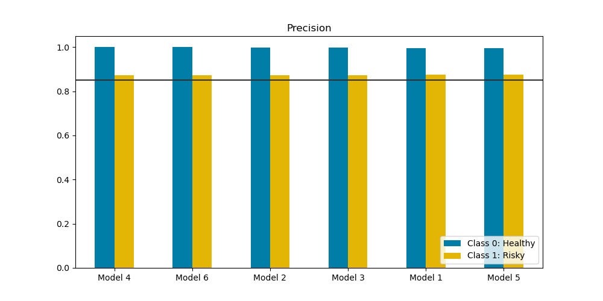
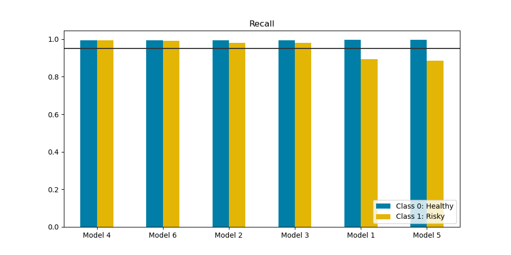

# Supervised Learning for Credit Risk Classification
Train and evaluate models to classify loan risks.

## File structure
* The `img` directory contains PNG images of the charts generated in the analysis
* The `Resources` directory contains the lending data provided by Monash University
* The `credit_risk_classification.ipynb` Jupyter notebook contains the main analysis, including the code and results
* The `ml_classification.py` module contains functions that are commonly used in classification projects (supervised learning)
* The `models_optimisation.ipynb` Jupyter notebook contains contains a side analysis with the aim to optimise some of the models' parameters
* The `style.py` module contains variables used to define the style of the charts, such as colors

All code is the author's, unless otherwise specifically specified.

This README files contains the main points from the analysis and our conclusions. The most complete and up-to-date report can be found in the `credit_risk_classification.ipynb` Jupyter notebook itself, from which most of the text below is copied for convenience.

## Overview of the Analysis
### Purpose
In this analysis, we look at the ability of different machine learning (ML) models to classify healthy and high-risk loans.

### About the data
The dataset includes the following information about the loans and the borrowers:
* loan size
* interest rate
* borrower income
* debt to income ratio
* number of accounts 
* derogatory marks 
* total debt of the borrower

Because the values range can differ a lot between the different columns, it is expected that the classifier will benefit from using scaled data. An initial model is used with the original data first to establish a baseline but scaled data will be used as a first optimisation step (see below.)

The loan status is the value we try to predict. It can take a value of 0 (healthy loans) or 1 (high-risk). The data provided include 75036 loans classified as healthy and 2500 classified as high-risk.

### Methods used
The following models form the `sklearn` library are evaluated:
* `LogisticRegression` with original data (Model 1) and scaled data (Model 2)
* `SVC` with scaled data (Model 3)
* `tree` with scaled data (Model 4)
* `RandomForest` with scaled data (Model 5)
* `KNeighborsClassifier` with scaled data (Model 6)

Note that PCA is not used as the number of features (dimensions) is reasonable and we do not expect any significant improvement by using Principal Components.

### Stages
We prepare the data for all the models in the next sections by performing the following steps:
* Import all necessary modules (there are no imports within the other code blocks)
* Load the data from the CSV file into a pandas DataFrame
* Split the data between the training and test sets using `train_test_split` from `sklearn`

For each of the models, we then perform the following steps
* Scaling (optional)
* Fitting (i.e. train the model with the training set)
* Predictions (i.e. use the test set )
* Describe the stages of the machine learning process you went through as part of this analysis.

### Results
A comparison between all the models is given in the table below.

<table>
    <tr>
        <th>Model</th>
        <th>Description</th>
        <th>Data</th>
        <th>accuracy</th>
        <th>precision_0</th>
        <th>precision_1</th>
        <th>recall_0</th>
        <th>recall_1</th>
    </tr>
    <tr>
        <td>Model 4</td>
        <td>DecisionTreeClassifier (max_depth = 3)</td>
        <td>Scaled</td>
        <td>0.9952</td>
        <td>0.9998</td>
        <td>0.8735</td>
        <td>0.9952</td>
        <td>0.9952</td>
    </tr>
    <tr>
        <td>Model 6</td>
        <td>KNeighborsClassifier (max_depth = 11)</td>
        <td>Scaled</td>
        <td>0.9950</td>
        <td>0.9997</td>
        <td>0.8732</td>
        <td>0.9952</td>
        <td>0.9920</td>
    </tr>
    <tr>
        <td>Model 2</td>
        <td>LogisticRegression</td>
        <td>Scaled</td>
        <td>0.9947</td>
        <td>0.9993</td>
        <td>0.8719</td>
        <td>0.9952</td>
        <td>0.9808</td>
    </tr>
    <tr>
        <td>Model 3</td>
        <td>SVC</td>
        <td>Scaled</td>
        <td>0.9947</td>
        <td>0.9993</td>
        <td>0.8719</td>
        <td>0.9952</td>
        <td>0.9808</td>
    </tr>
    <tr>
        <td>Model 1</td>
        <td>LogisticRegression</td>
        <td>Original</td>
        <td>0.9924</td>
        <td>0.9964</td>
        <td>0.8746</td>
        <td>0.9957</td>
        <td>0.8928</td>
    </tr>
    <tr>
        <td>Model 5</td>
        <td>RandomForestClassifier (n_estimators = 220)</td>
        <td>Scaled</td>
        <td>0.9923</td>
        <td>0.9962</td>
        <td>0.8765</td>
        <td>0.9958</td>
        <td>0.8864</td>
    </tr>
</table>

**Main observations**
* The accuracy is excellent for all models
* All models perform similarly against all metrics
* There is however a bigger spread in Class-1 recall (see next chart)
* Class-1 recall is probably the single most important performance metric for this application: we want to make sure that the lenders trust the models and provide and agree to loans that are correctly classified as healthy
* All models show Class-1 recall metrics of 0.88 or higher but Model 4 (decision tree) shows a near-perfect recall of 0.99, which greatly reduces the risk to the lenders

The precision and recall for the different models are shown in the charts below. The models are sorted by their Class-1 recall value.

### Recommendations
While all the models perform well with all metrics above 0.8 and usually close to 0.9, the Decision Tree Classifier offers oustanding performance when it comes to recall (ability to correctly classify risky loans as such) and therefore can be trusted by lenders who want to avoid unexpected risks.

Class-1 recall is by far the most variable metrics among the different metrics (accuracy, precision, recall.) Optimising for Class-1 recall will therefore have very limited impact on the other metrics and can be treated as a one-dimension optimisation problem.
